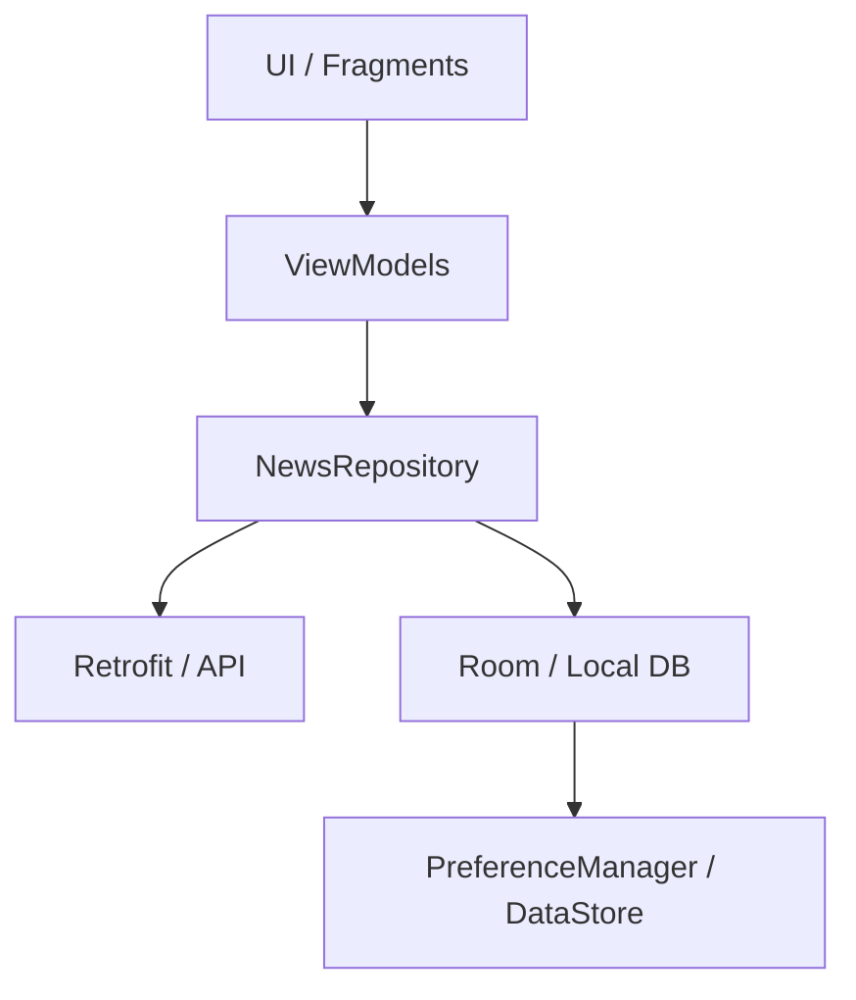

# 📱 BharatNews 🇮🇳
### A Modern Indian News Ecosystem | MVVM + Retrofit + Room + Razorpay

BharatNews is a premium Android application designed to deliver real-time, localized news to the Indian audience. Built with a focus on speed, personalization, and a high-quality user interface, it combines the latest Android development practices with a warm, Saffron-inspired aesthetic.

---

## 🚀 Vision
To create a news reading experience that feels like a blend of *Inshorts* and *Times of India* — clean, fast, and culturally resonant.

---

## ✨ Key Features

### 🏠 Home Ecosystem
- **Breaking News Ticker**: A continuous marquee for high-priority live updates.
- **Hero Carousel**: Top 5 featured stories presented in a full-bleed, high-impact ViewPager.
- **Vibrant Categories**: One-tap access to Cricket, Politics, Bollywood, Tech, Health, and more.
- **Trending Feed**: A dedicated section for the most viral news of the moment.

### 🔍 Intelligence & Search
- **Real-time Discovery**: Search as you type with a 500ms **debounce** logic to minimize API load.
- **Contextual Results**: Fetches news based on your specific keywords and language preference.

### 🔖 Offline Experience
- **One-Tap Bookmarks**: Save articles for later reading using a local **Room Database**.
- **Management**: Swipe-to-delete with an immediate **Undo** option via Snackbar.

### 💳 Monetization (Premium)
- **Razorpay Integration**: A seamless flow for a ₹1 premium subscription.
- **Secure Checkout**: Opens in a themed **Chrome Custom Tab** for trust and speed.

### 🎨 Personalization
- **Multi-Language Support**: Full localization in **English** and **Hindi** 🇮🇳.
- **Dynamic Typography**: Adjust text size (12sp - 24sp) via a slider in Settings.
- **Dark Mode**: A carefully crafted dark theme for night-time reading.

---

## 🛠️ Technical Architecture

The app follows the **MVVM (Model-View-ViewModel)** architectural pattern to ensure scalability and maintainability.

### High-Level Data Flow:
1. **Model**: Represents the data from the NewsData.io API and Room DB.
2. **Repository**: Acts as the single source of truth, managing data coordination between the network (Retrofit) and local storage (Room).
3. **ViewModel**: Exposes state via `LiveData` and handles UI logic in a lifecycle-aware manner.
4. **View**: Fragments (`Home`, `Search`, `Bookmarks`, `Settings`) observe the ViewModel and update the UI.

---

## 📂 Project Structure

- `data/api/`: Handles network configuration and API service definitions.
- `data/db/`: Contains the Room database, DAOs, and entities.
- `data/model/`: Pure data classes for API responses and database objects.
- `data/repository/`: The business logic layer for data management.
- `ui/`: All UI components, including Fragments, ViewModels, and Adapters.
- `utils/`: Common helpers like Constants, Extensions, and PreferenceManager.
- `App.kt`: The main Application class handling global locale and theme initialization.

---

## ⚙️ Setup & Installation

### 1. Requirements
- **Android Studio Ladybug** or newer.
- **JDK 11** or higher.
- **API Key**: Sign up at [newsdata.io](https://newsdata.io) to get your free key.

### 2. Configuration
- Open `app/src/main/java/com/trinoka/bharatnews/utils/Constants.kt`.
- Replace `API_KEY` with your provided key.

### 3. Build & Run
- Sync the project with Gradle files.
- Run on an emulator or physical device (Min SDK 26).

---

## 🤝 Contribution
Contributions are welcome! Please follow these steps:
1. Fork the project.
2. Create a feature branch (`git checkout -b feature/AmazingFeature`).
3. Commit your changes (`git commit -m 'Add AmazingFeature'`).
4. Push to the branch (`git push origin feature/AmazingFeature`).
5. Open a Pull Request.

---

## 📝 License
Copyright © 2026 BharatNews. Developed with ❤️ for India.
